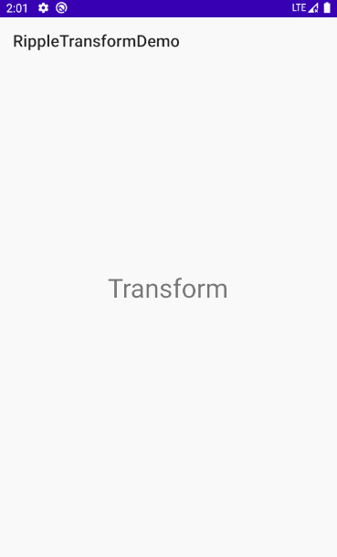

# RippleTransformLayout

[](https://jitpack.io/#l0neman/RippleTransformLayout)

## 介绍

可通过水波纹动画表现布局变换过程的 ViewGroup，可用于实现流畅的主题切换效果。

## 示例



## 集成

```groovy
// project build.gradle
allprojects {
    repositories {
        ...
        maven { url 'https://jitpack.io' }
    }
}

// module build.gradle
dependencies {
    implementation 'com.github.l0neman:RippleTransformLayout:v1.0'
}
```

## 使用

1. 对于想要换主题或改变布局的区域，使用 RippleTransformLayout 作为顶层布局，它是一个 FrameLayout。
2. 初始化 View。

```java
RippleTransformLayout rtl = findViewById(R.id.rtl_test);
```

3. 相关参数设置。

```java
 
mRtl.setDuration(400);            // 设置动画时长（400 ms）。
mRtl.setStartDelay(0);            // 设置启动延迟时间（0 ms）。
mRtl.setRippleCenter(0.5F, 0.5F); // 设置波纹动画圆心（布局中心点）。
```

4. 开始进行布局切换。

```java
mRtl.transform(new RippleTransformLayout.TransformAction() {
  @Override public void viewChange() {
    //这里执行布局切换或主题切换等逻辑，不可为 null（无意义）。
  }
}, new RippleTransformLayout.AnimatorCallback() {
  @Override public void onAnimatorEnded() {
    // 动画结监听器，可为 null。
  }
});
```

## License

```
Copyright 2020 l0neman

Licensed under the Apache License, Version 2.0 (the "License");
you may not use this file except in compliance with the License.
You may obtain a copy of the License at

    http://www.apache.org/licenses/LICENSE-2.0

Unless required by applicable law or agreed to in writing, software
distributed under the License is distributed on an "AS IS" BASIS,
WITHOUT WARRANTIES OR CONDITIONS OF ANY KIND, either express or implied.
See the License for the specific language governing permissions and
limitations under the License.
```